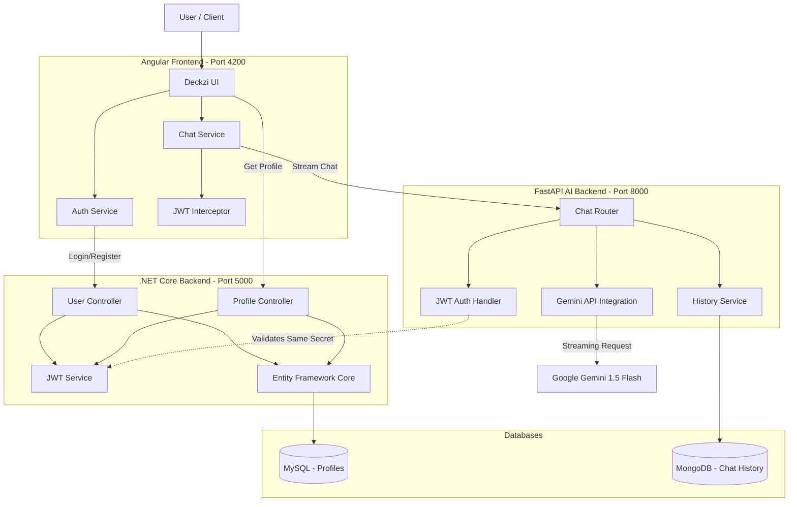

# Deckzi AI Chat - Architecture Diagram

## System Components

### 1. Angular Frontend
- **Deckzi UI**: Built with Angular 18 using Reactive Forms and a glassmorphism dark theme.
- **Chat Service**: Handles real-time streaming using the `Fetch API` and `ReadableStream`.
- **JWT Interceptor**: Automatically attaches the authorization token to outgoing requests.

### 2. FastAPI Backend (AI Service)
- **AI Integration**: Connects to **Gemini 1.5 Flash** for token-by-token streaming responses.
- **Prompt Protection**: Implements regex-based prompt injection detection.
- **Persistence**: Stores session-based conversation history in **MongoDB**.

### 3. .NET Core Backend (User Service)
- **User Management**: Handles registration and login using BCrypt for password hashing.
- **Profile Service**: Manages user preferences and display settings.
- **Persistence**: Uses **Entity Framework Core** to manage data in **MySQL**.

### 4. Shared Security
- **JWT Authentication**: Both backends share a common JWT secret, allowing a single token generated by either service to be validated by the other.
